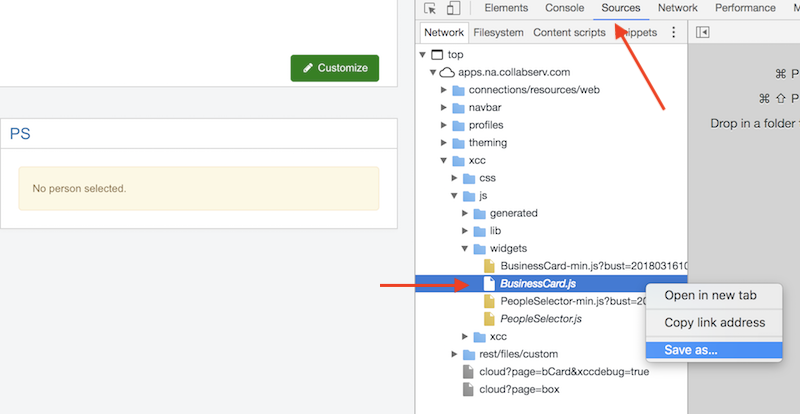
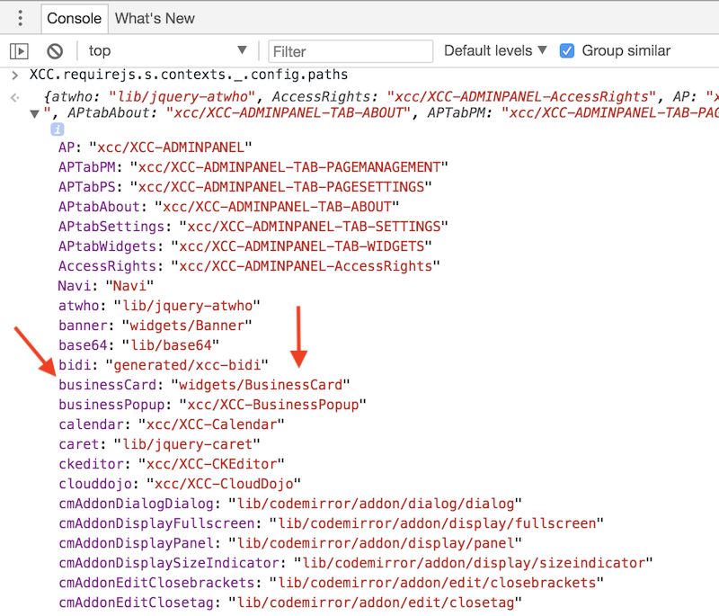

<a name="top"/>

We are going to build a widget from an existing ICEC widget.  We will create a copy of an existing widget and in addition to the content already provided in it by IBM Connections we will add additional data coming from an external content source. 

##### 1. Create a new widget

In a Visual Studio Code terminal window make sure that you are in the `icec-widgets-starter` directory. Issue the following command:

```
node scripts/createWidget.js bcard custom
```

We are going to make a copy of the Business Card widget and modify it using the following steps:

- Click on the nagivation link for Business Card to be taken to that page. Validate by looking for the page title and the `?page=bCard` in the URL displayed by the browser
- By default all widgets that are loaded on an ICEC page are minimized, we need to make a copy of the non-minimzed version. Add the `&xccdebug=true` parameter to the url to force a download of non-minimized versions of all widgets on the current page: `https://apps.na.collabserv.com/xcc/cloud?page=bCard&xccdebug=true` and hit on enter to refresh the page with the new parameter.
- Click on **Customize** > **Widgets** > **Create Widget** 
- Select the `People Selector` widget from the list and in the ID field enter a unique name **PS** and click on **Create**.
- Open the Developer Tools in your browser and change to the `Resources` tab.
- Expand the **apps.na.collabserv.com** > **xcc** > **js** > **widgets**
- Right click on the `BusinessCard.js` and select Save to download the widgets.  
- Save the widget to the `/src/widgets/BusinessCard/index.js` overwriting the one already there.



<br/>
##### 2. Initialize the widget

The default widget comes with a set of JavaScript modules and build tools pre-configured.  We need to install them.  Switch to directory that was just created and run `npm install`

```
cd src/widgets/bcard

npm install
```

<br/>
##### 3. Modify the widget

In the left navigation for Visual Studio code, expand the `src/widgets/bcard` folder, if you do not see the folder, click on the refresh icon on the top right to update your folder list.

- Click on the `index.js` to modify it.

- First modify the section in green to comment these lines that we no longer want to show on a business card.


- Copy and paste the following javascript to add in the section in red.  Make sure to specify your development server's url

```javascript
var sname = userData.email;
sname = sname.split("@")[0];
                    
$.get('https://8bb892c4.ngrok.io/regions?shortName=' + sname, function (data) {
    if (typeof data[0] !== 'undefined') {
        line3$.append($('<div class="pf-region"></div>')
        .append(data[0].region));
    }
});
```

- Save the file.

<br/>
##### 4. Build the widget

We need to preserve some information on the original widget we copied, i.e. the originalName that is used by ICEC to register that widget. In your Chrome browser developer console issue type the following command `XCC.requirejs.s.contexts._.config.paths` and hit on enter. Expand the resulting object:



The BusinessCard is the widget we are modifying, the internal name used by ICEC is `businessCard` as see in the screen shot above.  

Back to Visual Studio Code, in the left navigation for Visual Studio code, expand the `src/widgets/bcard` folder

- Click on the `webpack.config.js` to modify it.

- In the widgetName variable specify the name to be `businessCard` and change the next line to use `widgetName` as seen below.


- Save the file

In order to make the widget available to ICEC we are going to run a `build` task that packages all the required files and deploy them to our Development server under the `/build/public` directory and also under the `dist` directory. 

- Issue the following command from a terminal window while in `src/widgets/bcard` directory.

```
npm run build
```

- From the Visual Studio Code Explorer on the left panel, navigate to the `src/widgets/bcard/dist` and review the files there.  

- Repeat the above step for the `build/public` folder

- This widget is pure JavaScript with the html code inside of it, so only the js files are produced.
