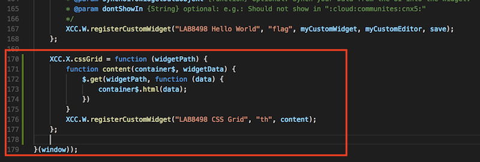
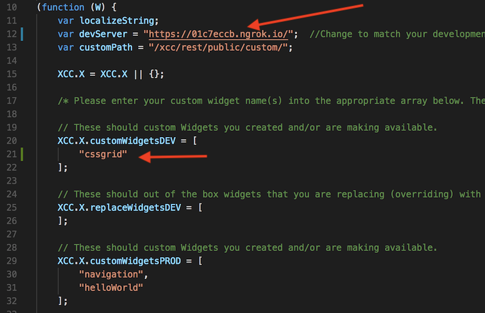
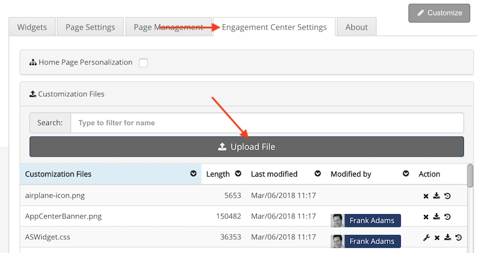
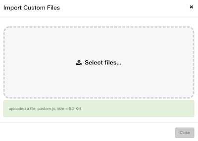

<a name="top"/>

###### 1. Register the cssgrid widget

Return to Visual Studio Code and in the left navigation expand **src** > **widgets** and click on `custom.js` to open it.  


- Add the following script right below the helloWorld section we worked on earlier

```javascript
	XCC.X.cssgrid = function (widgetPath) {
		function content(container$, widgetData) {
			$.get(widgetPath + ".html", function (data) {
				container$.html(data);
			})
		}
		XCC.W.registerCustomWidget("LAB8498 CSS Grid", "th", content);
	};
```

Your screen should look similar to the screen shot




The name of the widget is `cssgrid` as seen in the screen shot for the line that starts with `XCC.X.cssgrid = function() `.  We need to add that exact name to the appropriate variable.  This is a custom widget that is NOT replacing an existing ICEC widget.  We can add it to the `XCC.X.customWidgetsDEV` array as seen in the screen below:
<br/>


Note: if you have not yet updated the address to your Development server, you need to do so now.  

<br/>
- Click on **File** > **Save** to save the update you just made.

Return to the ICEC page using the Chrome browser.

- Click on **Customize** > **Engagement Center Settings** > **Customization Files** > **Upload File** 


- Navigate to the location of the `custom.js` that you saved in an earlier step, select it and click on Open. You should receive a result similar to the screen below confirming the file was uploaded.


<br/>

###### 2. Add the cssgrid widget to the CSSGRID page

- Click on the nagivation link for CSSGRID to be taken to that page. Validate by looking for the page title and the `?page=cssGrid` in the URL displayed by the browser
- Click on **Customize** > **Widgets** > **Create Widget** 

<p>
<span class="label label-info">Warning</span>
If the widget does not show up in the list, bring up your developer console and reload the page after clearing the cache as was done in a previous exercise.
</p>

- Select the `LAB8498 CSS Grid` widget from the list and in the ID field enter a unique name **LabCSSGrid** and click on **Create**.

The widget is added to the page with html code we added inside of it.  

<br/>

###### 3. Modifying and updating the widget

Return to Visual Studio Code and and let's add some styling to our plain HTML

- Copy and paste this code under the `src/widgets/cssgrid/index.css

```css
.mpcontainer {
  display: grid;
  grid-gap: 5px;
  grid-template-columns: repeat(auto-fit, minmax(100px, 1fr));
  grid-template-rows: repeat(2, 100px);
  grid-auto-rows: 100px;
}

.mpcontainer > div {
  display: flex;
  justify-content: center;
  align-items: center;
  font-size: 2em;
  color: #ffeead;
}

.mpcontainer > div:nth-child(1n) {
  background-color: #96ceb4;
}

.mpcontainer > div:nth-child(3n) {
  background-color: #88d8b0;
}

.mpcontainer > div:nth-child(2n) {
  background-color: #ff6f69;
}

.mpcontainer > div:nth-child(4n) {
  background-color: #ffcc5c;
}

```
- Take a look at the index.js and validate that the `index.css` is imported.  This will pull the CSS into the js file that is bundled by webpack.

- Save the modified files

In order to make the updates to the widget available to ICEC we are going to run a `build` task that packages all the required files/changes and deploy them to our Development server under the `/build/public` directory and also under the `dist` directory. 

- Issue the following command from a terminal window while in `src/widgets/cssgrid` directory.

```
npm run build
```

- Back to your browser, refresh the cssGrid page to see the changes


- Click on Customize on the page and experiment drag and dropping (moving) the widget around the ICEC page and see how it is responsive.  

You can now make updates to the widget as you iterate through your code, run a build process and test.  When you are ready to deploy to production, the following steps can be performed

<br/>
###### 4. Deploying to Production

Now that you have completed development of your widget, you want to deploy it to the ICEC server.  Every time you run a build process the minified version of your code is added to the `dist` folder.  You can take all the files from that directory and upload them to the ICEC server under customization.  

To switch from your development server to the ICEC server for serving the files, update the `custom.js` file and switch the location of the widget registration from the `XCC.X.customWidgetsDEV` array to the `XCC.X.customWidgetsPROD`.  

```javascript
	// These should custom Widgets you created and/or are making available.
	XCC.X.customWidgetsDEV = [
	];

	// These should out of the box widgets that you are replacing (overriding) with your own (can be derivative work or new). Example: "communityOverview"
	XCC.X.replaceWidgetsDEV = [
	];  

	// These should custom Widgets you created and/or are making available.
	XCC.X.customWidgetsPROD = [ 
		"navigation",
		"helloWorld",
		"cssgrid"
	];  
```

Refresh your browser cache and the widget will load from the ICEC server instead of your development server